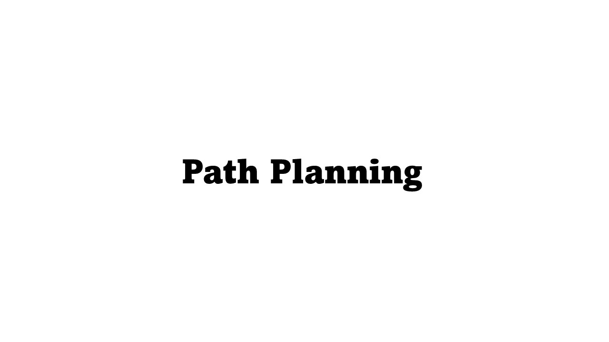

# Capstone Project - Jetbot

## Overview

This is a project developed from the Aerospace Engineering Practice Course of the Department of Aeronautic and Astronautic Engineering at National Cheng Kung University. Our goal is to build a self-driving car, which includes applications such as:

- **Traffic light detection**
- **Huamn detection**
  - HOG
- **Lane following**
  - sliding windows method
  - camera calibration
  - PID control
- **Path planning**
  - Astar
  - AruCo marker detection
- **Stopline recognition**

Environment required:

- OpenCV 4
- Ubuntu 18.04
- Python 3

## Lane Following

Using the window sliding method to detect the lane lines and applying PID control parameters to ensure the vehicle stays within the lane.

### Camera Calibration

In [camera calibration](https://github.com/Samhuang0727/Capstone-Project/tree/main/project/lane_following/calibration), using `calibration.py` to find chessboard corners with differnect angles and store the camera parameters in `calibation.npz`.We will oftenly use these parameters in further work. Figure below is the chessboard using for calibration and the calibration process.

### Lane Detection
Detecting lane lines and drawing them on the screen using the *Windows Sliding Method* and *image processing* such as Gaussian blur, Canny and Hough algorithm. If only one side of the lane line is visible on the screen, it can also be determined using a computational approach, you can find more detailed code in `pid_final.py`.

### PID Control
Utilizing the angle between the lane lines and the vehicle's centerline to determine the car's movement and turning direction, and then fine-tuning PID parameters to achieve this functionality.
- `PID_1.py`:Function of motor controls
- `PID_2.py`:Class of PID calculations and parameters setup
- `PID_Final.py`:Main program of lane following

## Traffic Light Detection

Using HSV to determine the color of traffic lights.

## Human Detection and Avoidance

Using HOG to detect the human body and draw a bounding box on the screen to allow the car to perform obstacle avoidance.
****
## Path Planning

### AruCo Marker Detection
Storing [AruCo Marker information](https://github.com/Samhuang0727/Capstone-Project/tree/main/project/path_planning/aruco_marker), including its orientation and 2D position on the [digital map](https://github.com/Samhuang0727/Capstone-Project/blob/main/project/path_planning/digital_map.jpg) (assuming the size of digital map is 600*600), in `aruco_params.npz` for future retrieval and use in path planning. The position of AruCo Markers wil siginificantly affects the direction of path planning, more precise of AruCo Markers coordinates, more accurate the path planning can be.

### Path Planning
After recognizing the AruCO marker, determine the current relative position of the car on the map and use the A star algorithm to calculate the shortest path to the destination.

- **Demo**

## Stopline Recognition

Using the size of the pixels and color recognition of the stop line on the frame to perform stop line recognition, and ensuring that the car stops before the stop line.
